---

<p align="center">
    
</p>

# OllaPy: Web Interface for Local LLMs

[](https://www.python.org/) [](https://flask.palletsprojects.com/) [](https://developer.mozilla.org/en-US/docs/Web/JavaScript) [](https://opensource.org/licenses/MIT)

**Tired of sending your deepest thoughts to third-party servers? Want the power of an LLM but within the privacy of your digital fortress (aka `localhost`)? Then you're in the right place.**

This project is a sleek, self-contained web interface to chat with your local language models via [Ollama](https://ollama.com/). It consists of a super-lightweight Python/Flask backend and a pure JavaScript frontend, with no bloated frameworks. Everything you need, nothing you don't.


 


---

## 🤔 Why This and Not Another?

There are many interfaces for Ollama, but this one was built with a few core principles in mind:

1.  **Absolute Privacy:** The only network request leaving your machine is to your local Ollama server. No data, no telemetry, no tracking cookies. Your `localhost`, your rules.
2.  **Simple Persistence:** Your chats don't vanish into thin air. They're saved as simple `.json` files in a `logs/` directory, making them easy to inspect, back up, or even edit by hand (you tinkerer!).
3.  **Zero Complex Dependencies:** No Node.js, no `npm install` with a billion packages. Just a simple Python server and an HTML file that works. It's so simple it's almost cute.
4.  **Hackable by Design:** The code is intentionally clear and commented. Want to change the model? It's a variable. Want to tweak the style? It's a CSS block. Want to add a feature? The code won't bite you.

## ✨ Cool Features

*   **💾 Chat History:** All your conversations are saved and listed in a handy sidebar. Click to load them, click the `x` to delete.
*   **✍️ Markdown Rendering:** The AI can format text with lists, tables, code blocks, and more, and the interface will render it beautifully.
*   **💨 Real-Time Streaming:** Watch the AI's response appear word by word, with a little blinking cursor, as if it's thinking just for you.
*   **📊 Token Counter:** Keep an eye on context size with a progress bar and counter, which changes color as you approach the limit.
*   **⏱️ Performance Meter:** Each AI response shows how long it took to generate. Great for bragging about your GPU's power.
*   **🛡️ Built-in Security:** HTML output is sanitized with `DOMPurify` to prevent XSS attacks. Because even on `localhost`, it's better to be safe.

## 🛠️ How This Thing Works (Architecture)

The system stands on two fundamental pillars:

1.  **`server.py` (The Librarian):**
    *   A super-lightweight **Flask** server.
    *   Its only purpose is to serve the `chat.html` file and handle a minimal REST API for `create`, `read`, `update`, and `delete` (CRUD) chat log files. It never talks to the AI.

2.  **`chat.html` (The Arena):**
    *   A single file containing **HTML**, **CSS**, and **vanilla JavaScript**.
    *   Communicates directly with your **Ollama** server (default `http://localhost:11434`).
    *   Communicates with `server.py` to save and load chat sessions.

```mermaid
graph TD
    A[User 👨‍💻] -- Interacts with --> B[Browser: chat.html]
    B -- "API Requests (Save/Load)" --> C[Backend Flask: server.py]
    C -- "Reads/Writes" --> D["Log Files<br/>(logs/*.json) 📝"]
    B -- "LLM Requests (Prompt)" --> E[Ollama Server 🧠]
    E -- "Streaming Response" --> B
```



## 🚀 Ready, Set, Go! (Installation)

Getting this little marvel up and running is a breeze.

### Prerequisites

1.  **Python 3** and `pip` installed.
2.  **Ollama installed and running.** If you haven't already, follow the instructions at [ollama.com](https://ollama.com/).
3.  **A downloaded model.** For example, to use `gemma3` (as set by default in the code):
    ```bash
    ollama pull gemma3
    ```

### Installation

1.  **Clone this repository:**
    ```bash
    git clone https://github.com/your-username/localhost-llm-chat.git
    cd localhost-llm-chat
    ```

2.  **Install Python dependencies (just Flask):**
    ```bash
    pip install Flask
    # Or, if you provide a requirements.txt:
    # pip install -r requirements.txt
    ```

3.  **Start the backend server:**
    ```bash
    python server.py
    ```
    You should see a message telling you the server is running at `http://localhost:8000`.

4.  **Open your browser** and go to:
    👉 **http://localhost:8000** 👈

Done! Now you can start chatting with your personal AI.

## ⚙️ Fine-Tuning (Configuration)

Want to use a model other than `gemma3`? Or is your Ollama running on a different port? Open `chat.html` and edit these JavaScript constants at the top of the script:

```javascript
// --- CONFIGURATION ---
const OLLAMA_MODEL = "mistral"; // Change to your preferred model
const MAX_CONTEXT_WINDOW = 8192; // Adjust if your model has a different context size
```

Remember to run `ollama pull model-name` for every new model you want to use!

## 🤓 API Endpoints (For Power Users)

The `server.py` server exposes a simple REST API for managing chats. You could use it to integrate the chat history with other scripts.

*   `GET /api/chats`
    *   **Response:** A JSON array listing all saved chats, ordered from newest to oldest. `{ "id": "...", "title": "..." }`

*   `GET /api/chats/<chat_id>`
    *   **Response:** The full JSON content of the specified chat.

*   `POST /api/chats`
    *   **Body:** The full JSON object of the chat to save/update.
    *   **Response:** Confirmation of save.

*   `DELETE /api/chats/<chat_id>`
    *   **Response:** Confirmation of deletion.

## 🤝 Want to Help? (Contributing)

This project was made to be simple, but there's always room for improvement! Pull Requests are more than welcome. Got a brilliant idea? Found a bug more annoying than a mosquito in your bedroom?

1.  Fork the repository.
2.  Create a new branch (`git checkout -b feature/your-crazy-idea`).
3.  Make your changes.
4.  Submit a Pull Request.

Some ideas to get started:
*   A selector to change models directly from the interface.
*   Themes (light/dark/cyberpunk?).
*   Export a single chat as Markdown or PDF.

---

**Happy Hacking, and may your `localhost` always be fast and responsive!**

