<p align="center">
    
</p>

<h1 align="center">OllaPy <br>Private, Self-Hosted Interface for Ollama</h1>


[](https://www.python.org/) [](https://flask.palletsprojects.com/) [](https://developer.mozilla.org/en-US/docs/Web/JavaScript) [](https://opensource.org/licenses/MIT)

OllaPy is a sleek, self-contained web interface for interacting with local language models through [Ollama](https://ollama.com/). It provides a private and secure environment for your conversations, running entirely on your local machine. With a lightweight Python/Flask backend and a vanilla JavaScript frontend, OllaPy is designed for simplicity, privacy, and hackability.

## 📖 Table of Contents

- [Features](#-features)
- [Architecture](#-architecture)
- [Getting Started](#-getting-started)
  - [Prerequisites](#prerequisites)
  - [Installation & Usage](#installation--usage)
- [Configuration](#-configuration)
- [API Endpoints](#-api-endpoints)
- [Contributing](#-contributing)

---

## ✨ Features

*   **💻 Desktop Application:** OllaPy can now be run as a standalone desktop application using Electron, providing a native-like experience.
*   **🔒 Absolute Privacy:** All interactions happen on your local machine. No data is ever sent to third-party servers.
*   **💾 Chat History:** Conversations are automatically saved as JSON files in a `logs` directory, allowing for easy access, backup, and management.
*   **🤖 Model Selection:** Seamlessly switch between different Ollama models using a dropdown menu in the user interface.
*   **✍️ Markdown Rendering:** Enjoy beautifully formatted AI responses, including lists, tables, and code blocks.
*   **💨 Real-Time Streaming:** Experience interactive conversations with the AI's responses streamed in real-time.
*   **📊 Token Counter:** Monitor the context size of your conversations with a progress bar and token counter.
*   **⏱️ Performance Metrics:** Track the generation time for each AI response.
*   **📈 System Monitoring:** Real-time display of CPU and RAM usage within the Electron application.
*   **🚀 Integrated Backend Startup:** The Electron application now automatically manages the startup and shutdown of the Flask backend server.
*   **🛑 Cancel Responses:** Interrupt the AI's response generation at any time.
*   **🛡️ Built-in Security:** Client-side HTML sanitization using `DOMPurify` to prevent XSS attacks.

## 🛠️ Architecture

OllaPy's architecture is composed of two main components:

1.  **`server.py` (Backend):** A lightweight Flask server that serves the main `index.html` file and provides a REST API for managing chat logs (CRUD operations).
2.  **`index.html` & JavaScript modules (Frontend):** A vanilla JavaScript application that communicates directly with the Ollama server for AI interactions and with the Flask server for chat history management.

```mermaid
graph TD
    A[User 👨‍💻] -- Interacts with --> B[Browser: index.html]
    B -- "API Requests (Save/Load)" --> C[Backend Flask: server.py]
    C -- "Reads/Writes" --> D["Log Files<br/>(logs/*.json) 📝"]
    B -- "LLM Requests (Prompt)" --> E[Ollama Server 🧠]
    E -- "Streaming Response" --> B
```



## 🚀 Getting Started

### Prerequisites

*   [Python 3](https://www.python.org/downloads/) and `pip`.
*   [Ollama](https://ollama.com/) installed and running.
*   At least one Ollama model downloaded (e.g., `ollama pull gemma3`).

### Installation & Usage

1.  **Clone the repository:**

    ```bash
    git clone https://github.com/your-username/ollapy.git
    cd ollapy
    ```